# Fence System Architecture

> **Version:** 3.4.11 telemetry baseline plus PER-383 scheduler cutover (historical targets still use SelfControl names)
> **Purpose:** Comprehensive technical documentation for developers and AI agents
> **Last Updated:** July 2026

---

## Table of Contents

1. [Executive Summary](#1-executive-summary)
2. [High-Level Architecture](#2-high-level-architecture)
3. [Component Deep Dive](#3-component-deep-dive)
4. [Blocking Mechanism](#4-blocking-mechanism)
5. [App Blocking (NEW)](#5-app-blocking-new)
6. [Data Flow Diagrams](#6-data-flow-diagrams)
7. [Module Reference](#7-module-reference)
8. [Security Model](#8-security-model)
9. [Debug Features](#6-debug-features)
10. [Quick Reference](#10-quick-reference)

---

## 1. Executive Summary

Fence is a macOS application that blocks selected websites, network resources, and apps for committed schedule windows. **The block cannot be disabled** until the timer expires—even restarting the computer won't help.

### Key Architectural Decisions

| Decision | Rationale |
|----------|-----------|
| **Triple-layer blocking** | /etc/hosts + PF firewall + App killer provides redundancy |
| **Privileged daemon** | Root access needed for system files; separated from UI |
| **XPC communication** | Secure IPC between unprivileged app and root daemon |
| **Continuous verification** | 1-second checkup timer ensures block persists |
| **Settings in /usr/local/etc** | Survives app deletion; requires root to modify |
| **App blocking via process kill** | Polls running apps every 500ms, kills blocked ones |
| **Privacy-safe remote diagnostics** | Typed app events plus a root-owned, consent-gated daemon spool; raw entries never leave the machine |
| **Root-owned schedule timing** | V2 owner/absolute-week commitment envelopes and segments are persisted atomically and reconciled by `selfcontrold`; user LaunchAgents are V1 drain-only |
| **Immutable commitment admission** | An unexpired overlapping envelope or schedule record (including V1) rejects a different batch even if the local `weekKey` changed; an exact same-batch retry with matching commitment+generation and records is idempotent. The legacy registration path reciprocally rejects an unexpired overlapping V2 envelope |

### Technology Stack

- **Language:** Objective-C
- **Frameworks:** Cocoa, Security.framework, ServiceManagement
- **IPC:** XPC (Mach message-based)
- **Firewall:** macOS Packet Filter (PF/pf.conf)
- **DNS Override:** /etc/hosts modification
- **Diagnostics:** Sentry in the app only; daemon records move through authenticated XPC

---

## 2. High-Level Architecture

### 2.1 System Overview

```mermaid
graph TB
    subgraph "User Space"
        APP[Fence.app<br/>Bundle: org.eyebeam.Fence]
        CLI[selfcontrol-cli<br/>V1 Compatibility Tool]
    end

    subgraph "Privileged Space (root)"
        DAEMON[selfcontrold<br/>LaunchDaemon]
    end

    subgraph "System Resources"
        HOSTS[/etc/hosts]
        PF[/etc/pf.conf<br/>+ /etc/pf.anchors/org.eyebeam]
        SETTINGS[/usr/local/etc/.{hash}.plist<br/>active state + V1/V2 schedules]
        LAUNCHD[launchd]
    end

    APP -->|XPC| DAEMON
    CLI -->|XPC| DAEMON
    DAEMON -->|Modify| HOSTS
    DAEMON -->|pfctl| PF
    DAEMON -->|Read/Write| SETTINGS
    SETTINGS -->|V2 wall-clock authority| DAEMON
    LAUNCHD -->|Manages| DAEMON

    style DAEMON fill:#ff6b6b,color:#fff
    style HOSTS fill:#4ecdc4,color:#fff
    style PF fill:#4ecdc4,color:#fff
```

### 2.2 Process Relationships

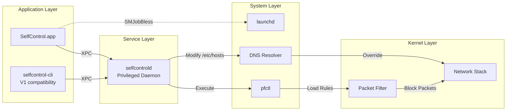

---

## 3. Component Deep Dive

### 3.1 Main Application (SelfControl.app)

**Purpose:** User interface for configuring and starting blocks

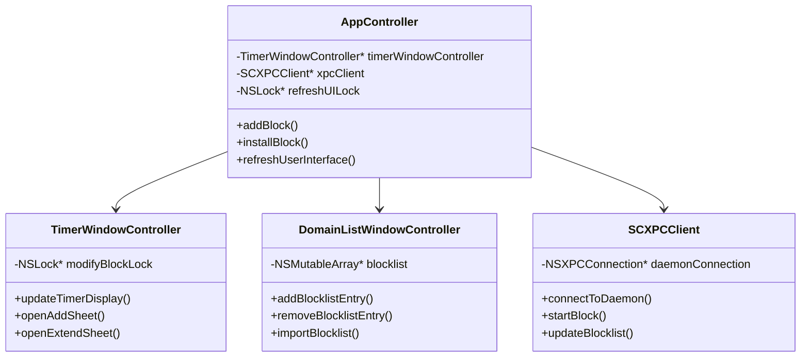

**Key Files:**
| File | Lines (2026-07-14) | Purpose |
|------|-------|---------|
| `AppController.m` | 2018 | Main app controller, block installation, helper compatibility repair |
| `TimerWindowController.m` | 482 | Timer display, add/extend sheets |
| `DomainListWindowController.m` | 465 | Blocklist editor table view |

### 3.2 Daemon (selfcontrold)

**Purpose:** Privileged helper that modifies system files

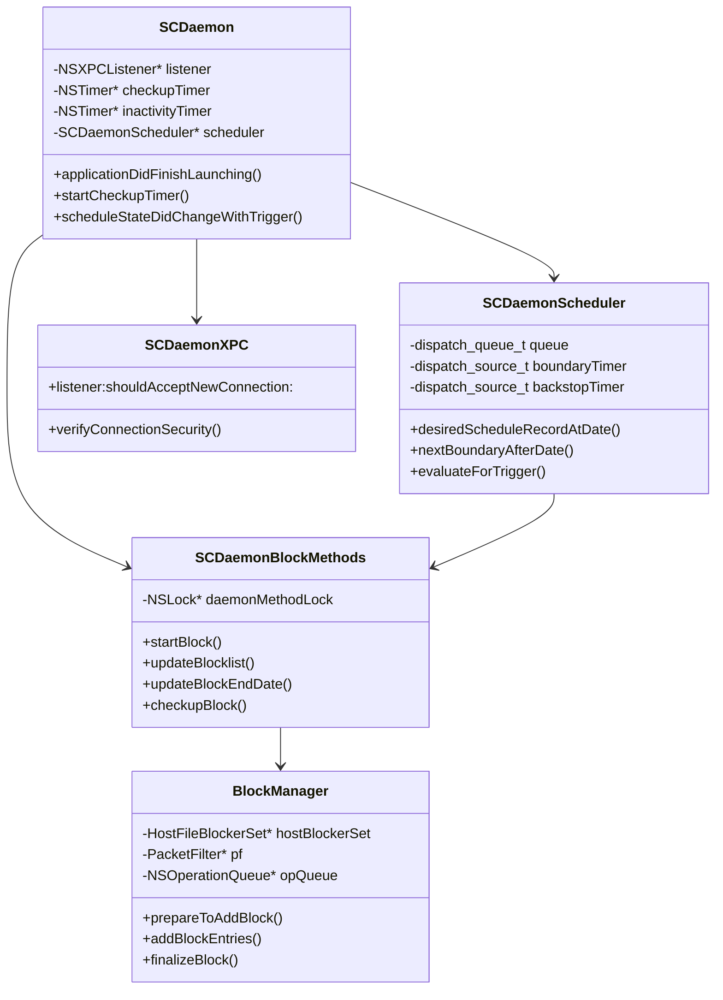

**Key Files:**
| File | Lines (2026-07-14) | Purpose |
|------|-------|---------|
| `Daemon/SCDaemon.m` | 475 | Daemon lifecycle plus scheduler trigger wiring |
| `Daemon/SCDaemonScheduler.m` | 468 | V1/V2 selection, exact boundary timer, 60-second backstop, serialized reconciliation |
| `Daemon/SCDaemonScheduler.h` | 79 | Injected scheduler contract, V2 keys, and active-source constants |
| `Daemon/SCDaemonBlockMethods.m` | 1106 | Block control, provenance, physical apply/teardown |
| `Daemon/SCDaemonXPC.m` | 2081 | Authenticated XPC, immutable V2 envelope, validated record store, strictify, diagnostics |

### 3.3 Block Management Layer

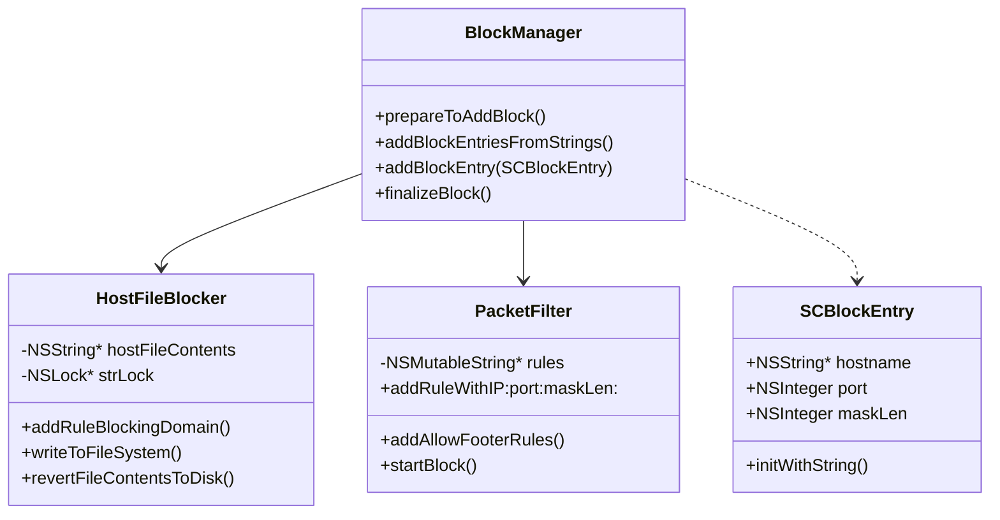

**Key Files:**
| File | Lines (2026-07-14) | Purpose |
|------|-------|---------|
| `Block Management/BlockManager.m` | 960 | Orchestrates all blocking |
| `Block Management/HostFileBlocker.m` | 332 | /etc/hosts manipulation |
| `Block Management/PacketFilter.m` | 491 | PF rule generation |
| `Block Management/SCBlockEntry.m` | 154 | Block entry data model |

### 3.4 Root-Owned Schedule Authority

New commitments are V2 owner/absolute-week transactions. `SCScheduleManager`
computes the complete week (which may contain zero blocking segments), and
`SCXPCClient` sends one authenticated batch after
requiring daemon protocol 5 plus `root-schedule-store-v2` and
`root-schedule-timer-v1`. `SCDaemonXPC` derives the owner from the accepted XPC
connection and validates the envelope and every segment. If the same
commitment+generation and records are already stored, the call is idempotent. A different
batch is rejected whenever its absolute week overlaps an unexpired commitment
envelope or schedule record (including V1) owned by that user, regardless of a
timezone-derived `weekKey` change. Otherwise the daemon atomically stores the immutable
`ApprovedScheduleCommitments` envelope plus its `ApprovedSchedules` records,
persists once, and verifies the envelope plus every validated record field in
the post-sync SCSettings view (not through an independent raw-disk reread).

```mermaid
sequenceDiagram
    participant App as Fence.app
    participant XPC as SCXPCClient
    participant Store as SCDaemonXPC/root settings
    participant Scheduler as SCDaemonScheduler
    participant Block as SCDaemonBlockMethods

    App->>App: Compile non-overlapping absolute segments
    App->>XPC: replaceScheduledCommitmentForWeekKey(...)
    XPC->>XPC: Require protocol 5 + root scheduler capabilities
    XPC->>Store: Authenticated owner/week batch
    Store->>Store: Validate overlap/idempotency; persist + verify envelope/records
    Store->>Scheduler: Reconcile mutation
    Scheduler->>Scheduler: Select start <= now < end
    Scheduler->>Block: Apply desired record or defer by provenance
    Store-->>App: Aggregate verified result
```

The evaluator runs on a serial queue at startup, the next exact wall-clock
boundary, wake, clock/timezone change, store mutation, active-block completion,
and a 60-second backstop. Root records and recomputation are the correctness
authority; timers provide promptness.

Manual and test blocks are never replaced. An active-to-active V2 mutation is
also deferred because the physical layer does not yet support staging new
PF/hosts/AppBlocker rules before removing obsolete ones. The existing
one-minute inter-segment compatibility gap remains in this cutover.

Existing unexpired V1 approvals/jobs and CLI selectors remain only for bounded
current/next-week rollback/drain. They are not replaced by a V2 commit: an
overlapping V2 batch is rejected until they expire. Diagnostics and strictify
inspect user LaunchAgents only for V1 records. See
[`docs/SCHEDULE_JOB_LIFECYCLE.md`](docs/SCHEDULE_JOB_LIFECYCLE.md).

The compatibility guard is bidirectional: the legacy V1 registration selector
also rejects any request whose absolute start/end overlaps an unexpired V2
envelope for the authenticated owner. Release builds reject the bulk
approved-schedule clear selector. DEBUG builds keep that test escape hatch but
clear `ApprovedSchedules` and `ApprovedScheduleCommitments` together so tests
cannot leave an orphaned authority map.

### 3.5 Telemetry and consistency diagnostics

The app is the only process that links Sentry. `selfcontrold` never owns a
network transport: it writes privacy-validated records under
`/usr/local/etc/fence-telemetry/<uid>/`, and an audit-token-authenticated Fence
client fetches and acknowledges its own queue after explicit consent.

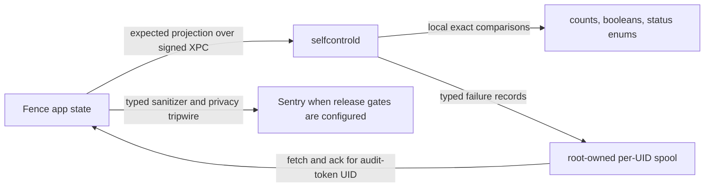

Core boundaries:

- `Common/SCSentry` owns typed schemas, consent lifecycle, SDK containment,
  and the final serialized-payload privacy tripwire.
- `Common/SCTelemetrySpool` owns locked/atomic per-UID queue storage, hard
  size/count/age bounds, consent generations, fetch/ack, and opt-out purge.
- `SCScheduleManager` builds an app-local expected active/future projection and
  V2 manifest. `SCDaemonXPC` compares it to root settings and
  hosts/PF/app state; validated plist/loaded-job probes apply only to V1. The
  reply contains no entries, dates, labels, UIDs, revisions, or IDs.
- `schedule.commit_store_failed` reports aggregate V2 transaction failures in
  the app. `schedule.reconcile_anomaly` reports daemon apply/load/teardown
  failures through the existing per-UID spool. Successful/no-op evaluations
  and intentional arbitration deferrals do not emit.
- `SCBlockApplyResult` and teardown results make physical postconditions—not
  declared settings mutation—the success authority for apply, strictify,
  integrity reapply, and cleanup.
- Active schedule comparison checks owner/source, schedule and policy identity,
  V2 commitment/generation, allowlist mode, and canonical content. When
  strictify targets the currently active scheduled record, the daemon holds its
  mutation lock while it physically applies and verifies additions, then
  persists the stricter root record; a failed physical append cannot be
  reported as a successful future-only mutation.
- A corrupt/unreadable initial SCSettings file is an explicit unavailable
  state. Automatic teardown and ordinary mutation/persistence pause until a
  valid authoritative state recovers (or the narrow first-run bootstrap creates
  a genuinely missing file).

The complete privacy contract, current coverage, and production gates live in
[`docs/TELEMETRY.md`](docs/TELEMETRY.md).

---

## 4. Blocking Mechanism

### 4.1 Two-Layer Defense

SelfControl uses **two independent blocking mechanisms** for redundancy:

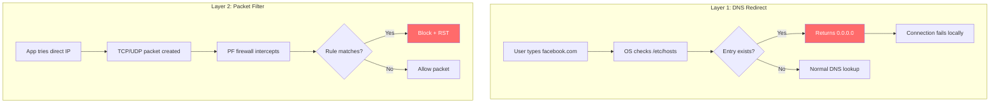

### 4.2 /etc/hosts Blocking

**How it works:**
1. Backup original: `/etc/hosts` → `/etc/hosts.bak`
2. Add SelfControl block section with markers
3. For each domain: add `0.0.0.0 domain` and `:: domain`
4. DNS lookups now return localhost (connection fails)

**Example /etc/hosts modification:**
```
# Normal system entries...
127.0.0.1 localhost

# BEGIN SELFCONTROL BLOCK
0.0.0.0    facebook.com
::    facebook.com
0.0.0.0    www.facebook.com
::    www.facebook.com
0.0.0.0    twitter.com
::    twitter.com
# END SELFCONTROL BLOCK
```

### 4.3 Packet Filter (PF) Blocking

**How it works:**
1. Resolve domains to IP addresses via DNS
2. Generate PF rules for each IP
3. Write to `/etc/pf.anchors/org.eyebeam`
4. Add anchor reference to `/etc/pf.conf`
5. Execute `pfctl -f /etc/pf.conf` to load rules

**Example PF rules (blocklist mode):**
```
# Blocklist rules
block return out proto tcp from any to 157.240.1.35
block return out proto udp from any to 157.240.1.35
block return out proto tcp from any to 104.244.42.1
block return out proto udp from any to 104.244.42.1

# Always allow essential services
pass out proto udp from any to any port 53    # DNS
pass out proto udp from any to any port 123   # NTP
pass out proto udp from any to any port 67    # DHCP
pass out proto udp from any to any port 68    # DHCP
pass out proto udp from any to any port 5353  # mDNS
pass out on lo0 all                           # Loopback
```

**Allowlist mode (inverse logic):**
```
# Block everything by default
block return out proto tcp from any to any
block return out proto udp from any to any

# Only allow specific destinations
pass out proto tcp from any to 1.2.3.4
pass out proto udp from any to 1.2.3.4

# Essential services still allowed
pass out proto udp from any to any port 53
# ... etc
```

### 4.4 Block Entry Format

```
Format: [hostname]:[port]/[masklen]

Examples:
  facebook.com           - Block all ports
  smtp.gmail.com:25      - Block only port 25
  192.168.1.0/24         - Block IP range
  *:443                  - Block port 443 everywhere
```

---

## 5. Data Flow Diagrams

### 5.1 Block Activation Flow

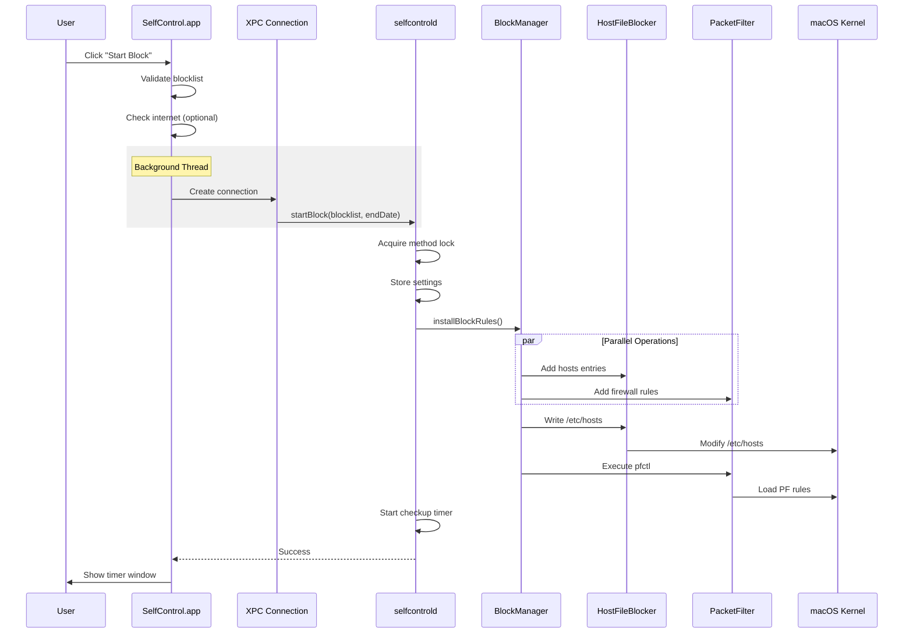

### 5.2 Checkup Timer Flow

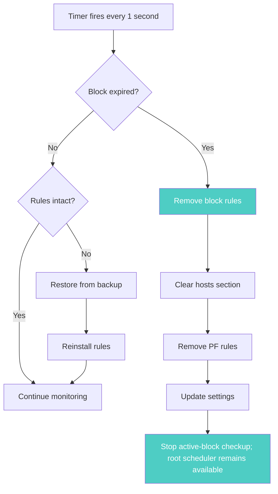

### 5.3 Settings Synchronization

```mermaid
flowchart LR
    subgraph "App (User Space)"
        A[SCSettings<br/>Read-Only Mode]
    end

    subgraph "Daemon (Root)"
        B[SCSettings<br/>Read-Write Mode]
        C[Sync Timer<br/>30 sec batching]
    end

    subgraph "Filesystem"
        D[/usr/local/etc/.{hash}.plist]
    end

    A -->|Read| D
    B -->|Write| D
    C -->|Debounced| B

    style D fill:#4ecdc4,color:#fff
```

---

## 6. Module Reference

### 6.1 Directory Structure

```
SelfControl/
├── AppController.m/h              # Main app UI controller
├── TimerWindowController.m/h      # Active block timer window
├── DomainListWindowController.m/h # Blocklist editor
├── cli-main.m                     # CLI entry point
│
├── Block Management/              # CORE BLOCKING LOGIC
│   ├── BlockManager.m/h          # Orchestrator
│   ├── HostFileBlocker.m/h       # /etc/hosts
│   ├── HostFileBlockerSet.m/h    # Multiple hosts files
│   ├── PacketFilter.m/h          # PF rules
│   ├── SCBlockEntry.m/h          # Block entry model
│   ├── HostImporter.m/h          # Import from mail apps
│   └── AllowlistScraper.m/h      # Parse allowlists
│
├── Daemon/                        # PRIVILEGED DAEMON
│   ├── DaemonMain.m              # Entry point
│   ├── SCDaemon.m/h              # Lifecycle & XPC listener
│   ├── SCDaemonScheduler.m/h     # Root schedule timing/reconciliation
│   ├── SCDaemonBlockMethods.m/h  # Block operations
│   ├── SCDaemonXPC.m/h           # XPC handler
│   └── SCDaemonProtocol.h        # XPC interface
│
├── Common/                        # SHARED CODE
│   ├── SCSettings.m/h            # Settings management
│   ├── SCXPCClient.m/h           # App-side XPC
│   ├── SCBlockFileReaderWriter.m/h # .selfcontrol files
│   ├── SCFileWatcher.m/h         # Tamper detection
│   └── Utility/
│       ├── SCBlockUtilities.m/h  # Block state checks
│       ├── SCHelperToolUtilities.m/h # Privileged ops
│       └── SCMiscUtilities.m/h   # General helpers
│
├── SCKillerHelper/                # Kill processes helper
└── SelfControl Killer/            # App killer GUI
```

### 6.2 Key Classes Quick Reference

| Class | Purpose | Touch for... |
|-------|---------|--------------|
| `AppController` | Main UI, block initiation | UI changes, block start flow |
| `BlockManager` | Orchestrates blocking | Adding new block types |
| `HostFileBlocker` | /etc/hosts manipulation | DNS-level blocking |
| `PacketFilter` | PF rule generation | Firewall rules |
| `SCBlockEntry` | Block entry data model | New entry formats |
| `SCDaemonBlockMethods` | Daemon block operations | Block lifecycle |
| `SCDaemonScheduler` | Root-owned schedule timing and selection | V2 boundaries, wake/reboot/clock recovery, arbitration |
| `SCSettings` | Centralized settings | New preferences |
| `SCXPCClient` | App→Daemon communication | New XPC methods |

---

## 7. Security Model

### 7.1 Privilege Separation

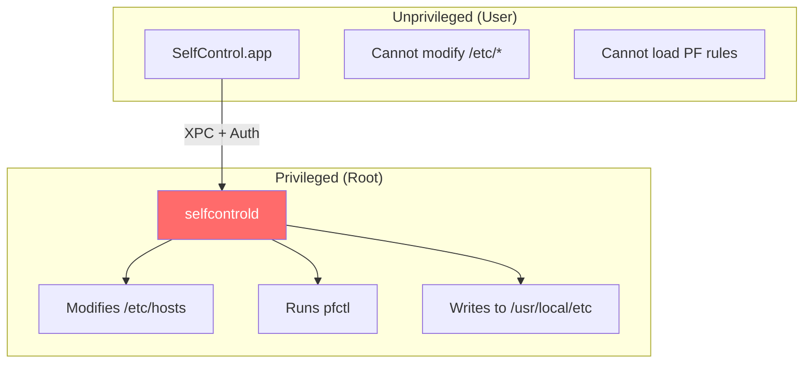

### 7.2 XPC Security

1. **Code Signing Verification:** Daemon validates app's certificate
2. **Bundle ID Check:** Only `org.eyebeam.SelfControl` or CLI accepted
3. **Version Check:** Minimum version 4.0.7 required
4. **Team ID Validation:** Must match `L5YX8CH3F5`

### 7.3 Tampering Detection

```mermaid
flowchart LR
    A[SCFileWatcher] -->|Monitors| B[/etc/hosts]
    B -->|Changed| C{Block active?}
    C -->|Yes| D[checkBlockIntegrity]
    D -->|Tampered| E[Set TamperingDetected]
    E --> F[Change wallpaper]
    D -->|OK| G[Continue]

    style F fill:#ff6b6b,color:#fff
```

---

## 5. App Blocking (NEW)

### 5.1 Overview

App blocking adds a third layer of protection by monitoring and killing blocked applications.

```
┌─────────────────────────────────────────────────────────────────────────┐
│                    THREE-LAYER BLOCKING ARCHITECTURE                     │
├─────────────────────────────────────────────────────────────────────────┤
│                                                                          │
│   Layer 1: DNS Redirect (/etc/hosts) ............ [EXISTING]            │
│   Layer 2: Packet Filter (PF Rules) ............. [EXISTING]            │
│   Layer 3: App Blocker (Process Kill) ........... [NEW]                 │
│                                                                          │
└─────────────────────────────────────────────────────────────────────────┘
```

### 5.2 Entry Format

```
facebook.com           → Network block (Layer 1 + 2)
app:com.apple.Terminal → App block (Layer 3)
app:com.cursor.Cursor  → App block (Layer 3)
smtp.gmail.com:25      → Port-specific block (Layer 1 + 2)
```

### 5.3 Key Components

| File | Purpose |
|------|---------|
| `Block Management/AppBlocker.h/m` | Process monitor with 500ms timer |
| `Block Management/SCBlockEntry.h/m` | Extended with `appBundleID` property |
| `Block Management/BlockManager.h/m` | Routes app entries to AppBlocker |

### 5.4 How It Works

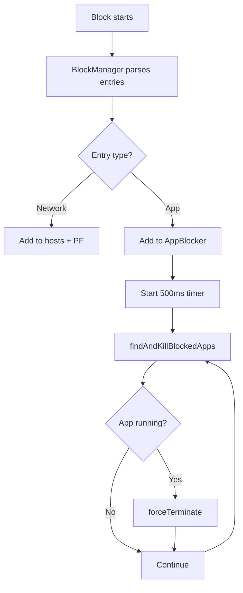

---

## 6. Debug Features

All debug features are **DEBUG builds only** - compiled out of release builds via `#ifdef DEBUG`.

### 6.1 Disable All Blocking

Debug mode allows disabling ALL blocking during development.

- **Access:** Debug > Disable All Blocking menu
- **Indicator:** Window title shows "[DEBUG - BLOCKING DISABLED]"

**What Gets Bypassed:**

| Blocker | When debug mode ON |
|---------|-------------------|
| PacketFilter.startBlock | Returns early, no PF rules |
| HostFileBlocker.writeNewFileContents | Returns early, no hosts changes |
| AppBlocker.findAndKillBlockedApps | Returns empty array, no kills |

### 6.2 Startup Safety Check

Automatically verifies blocking works correctly after macOS or app version changes.

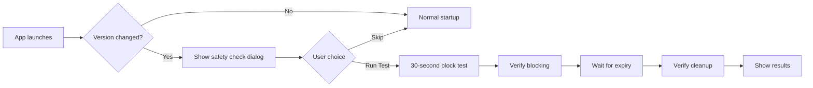

**Trigger Conditions:**
- First launch after macOS update
- First launch after SelfControl app update
- User can skip (versions marked as tested)

**What Gets Tested:**

| Test | Verifies |
|------|----------|
| Hosts block | example.com added to /etc/hosts |
| PF block | Packet filter rules loaded |
| App block | Calculator.app gets killed |
| Hosts cleanup | example.com removed after expiry |
| PF cleanup | Packet filter rules removed |
| App cleanup | Calculator.app can run again |

**Key Files:**

| File | Purpose |
|------|---------|
| `Common/SCStartupSafetyCheck.h/m` | Test orchestration |
| `Common/Utility/SCVersionTracker.h/m` | Version change detection |
| `SCSafetyCheckWindowController.h/m` | Test UI window |

**Test Parameters:**
- Duration: 30 seconds
- Network target: example.com
- App target: com.apple.calculator (Calculator)

---

## 7. Extension Points

### 7.1 Adding New Block Types

The current architecture is extensible via:

1. **SCBlockEntry** - Add new properties (like `appBundleID`)
2. **BlockManager** - Route entries to appropriate blockers
3. **New Blocker Class** - Implement blocking logic

### 7.2 Future Possibilities

| Extension | Approach |
|-----------|----------|
| System Extension (ES) | Prevent app launch entirely (no flicker) |
| Network Extension | Per-app network blocking |
| Screen Time integration | Use native macOS APIs |

---

## 8. Quick Reference

### 8.1 Important Paths

| Path | Purpose |
|------|---------|
| `/etc/hosts` | DNS redirect rules |
| `/etc/hosts.bak` | Backup before modification |
| `/etc/pf.conf` | Packet filter main config |
| `/etc/pf.anchors/org.eyebeam` | SelfControl's PF rules |
| `/usr/local/etc/.{SHA1}.plist` | Persistent settings |
| `/Library/LaunchDaemons/org.eyebeam.selfcontrold.plist` | Daemon config |
| `/Library/PrivilegedHelperTools/org.eyebeam.selfcontrold` | Daemon binary |

### 8.2 Key Settings

| Setting | Type | Purpose |
|---------|------|---------|
| `BlockIsRunning` | BOOL | Is block currently active? |
| `BlockEndDate` | NSDate | When does block expire? |
| `ActiveBlocklist` | Array | Currently blocked entries |
| `ActiveBlockAsWhitelist` | BOOL | Allowlist mode? |
| `ApprovedSchedules` | Dictionary | Root-owned V1/V2 pre-authorized schedule records |
| `ApprovedScheduleCommitments` | Dictionary | Root-owned immutable V2 owner/absolute-week envelopes, including zero-segment commitments |
| `ActiveBlockSource` | String enum | `none`, `manual`, `test`, `legacy_schedule`, or `scheduler_v2` provenance |
| `ActiveScheduleID` | String | Local idempotency/comparison identifier for a schedule-owned active block |
| `ActiveScheduleCommitmentID` | String | Local V2 commitment provenance |
| `ActiveScheduleGeneration` | String | Local V2 commitment generation/idempotency provenance |
| `ActiveSchedulePolicyRevision` | String | Local V2 policy comparison revision |
| `ActiveScheduleWeekKey` | String | Local week scope for active V2 provenance |
| `IsTestBlock` | BOOL | Marks safety-test enforcement so schedule reconciliation defers |
| `TamperingDetected` | BOOL | Was tampering found? |
| `EvaluateCommonSubdomains` | BOOL | Auto-block www., mail., etc.? |
| `IncludeLinkedDomains` | BOOL | Block related domains? |
| `AllowLocalNetworks` | BOOL | Allow LAN access? |
| `ClearCaches` | BOOL | Clear browser caches? |
| `DebugBlockingDisabled` | BOOL | Debug override (DEBUG builds only) |

### 8.3 Error Codes

| Code | Meaning |
|------|---------|
| 100 | Blocklist empty (non-allowlist mode) |
| 104 | Block already running |
| 300 | Daemon method lock timeout |
| 301 | Cannot start - block running |
| 302 | Blocklist empty or block expired |

### 8.4 XPC Methods

```objc
// Start a new block
- (void)startBlockWithControllingUID:(uid_t)uid
                           blocklist:(NSArray<NSString*>*)blocklist
                         isAllowlist:(BOOL)isAllowlist
                             endDate:(NSDate*)endDate
                       blockSettings:(NSDictionary*)settings
                               reply:(void(^)(NSError*))reply;

// Add entries to active block
- (void)updateBlocklist:(NSArray<NSString*>*)newEntries
                  reply:(void(^)(NSError*))reply;

// Extend block duration
- (void)updateBlockEndDate:(NSDate*)newEndDate
                     reply:(void(^)(NSError*))reply;

// Get daemon version
- (void)getVersionWithReply:(void(^)(NSString*))reply;

// Atomically admit one immutable authenticated V2 absolute-week commitment
// (an exact same-batch identity/content retry is idempotent) and reconcile it
- (void)replaceScheduledCommitmentForWeekKey:(NSString *)weekKey
                               weekStartDate:(NSDate *)weekStartDate
                                 weekEndDate:(NSDate *)weekEndDate
                                commitmentID:(NSString *)commitmentID
                                  generation:(NSString *)generation
                                    segments:(NSArray<NSDictionary *> *)segments
                               authorization:(NSData *)authorization
                                       reply:(void(^)(NSDictionary *, NSError *))reply;
```

---

## Appendix A: Build Targets

| Target | Type | Output |
|--------|------|--------|
| SelfControl | Application | SelfControl.app |
| selfcontrold | Helper Tool | org.eyebeam.selfcontrold |
| selfcontrol-cli | Command Line | selfcontrol-cli |
| SCKillerHelper | Helper Tool | SCKillerHelper |
| SelfControl Killer | Application | SelfControl Killer.app |

---

## Appendix B: Thread Safety

| Lock | Location | Purpose |
|------|----------|---------|
| `refreshUILock_` | AppController | Prevent UI race conditions |
| `modifyBlockLock` | TimerWindowController | Single add/extend sheet |
| `strLock` | HostFileBlocker | Thread-safe hosts manipulation |
| `daemonMethodLock` | SCDaemonBlockMethods | Exclusive block operations |
| Scheduler serial queue | SCDaemonScheduler | Coalesced desired-state evaluation and timer ownership |

---

## Appendix C: Notification Names

| Notification | Purpose |
|--------------|---------|
| `org.eyebeam.SelfControl.SCSettingsValueChanged` | Settings changed (distributed) |
| `SCConfigurationChangedNotification` | Internal config change |

---

*This document is auto-generated and should be updated when significant architectural changes are made.*
