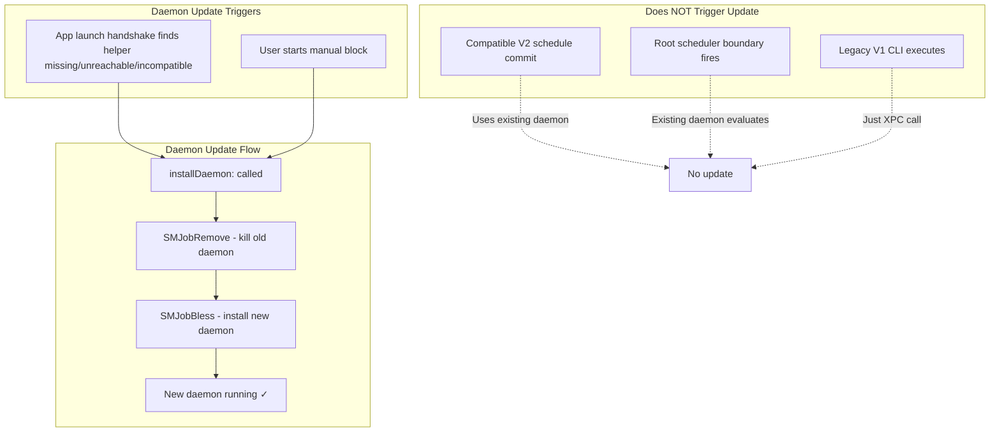
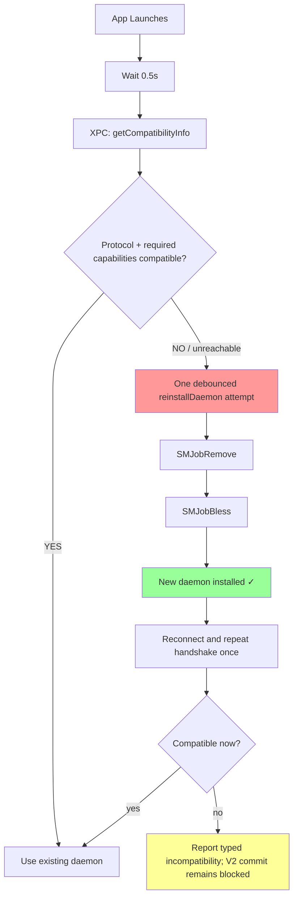
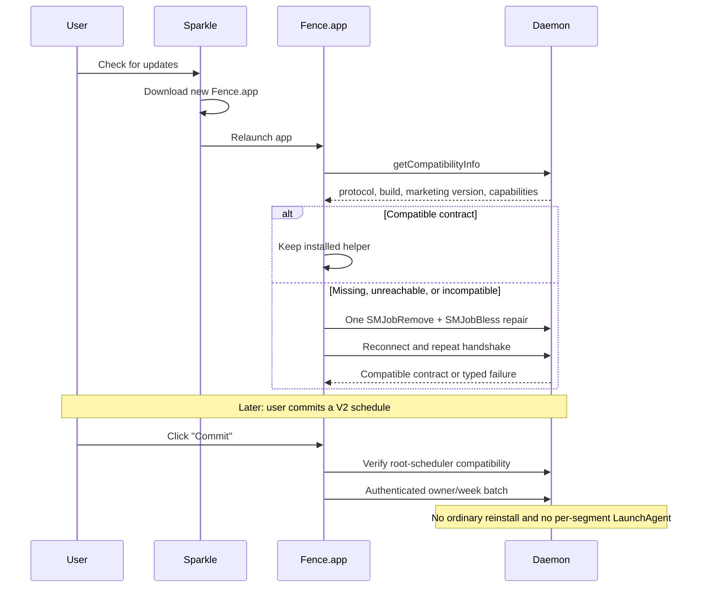
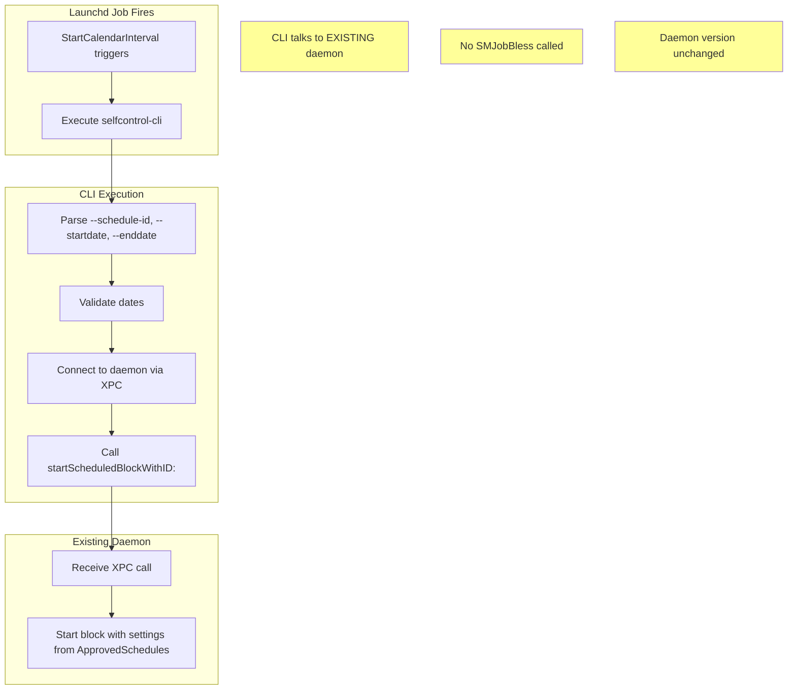

# Daemon Update Lifecycle

This document describes how the privileged daemon (`selfcontrold`) gets updated when the app is updated via Sparkle.

## Overview

The daemon is installed via `SMJobBless` to
`/Library/PrivilegedHelperTools/org.eyebeam.selfcontrold`. The current app runs
a protocol-and-capability handshake after launch and repairs a missing,
unreachable, or incompatible helper once. Marketing-version ordering is not
the authority.

PER-383 removes ordinary schedule commit as an installation trigger. A V2
commit requires daemon protocol 5 plus `root-schedule-store-v2` and
`root-schedule-timer-v1`; if the launch-time repair did not produce that
contract, the commit fails closed instead of writing partial state. Manual
block installation retains its existing explicit helper-install flow.

## Update Triggers



## App Launch Flow



## Sparkle Update Scenario



## Legacy V1 LaunchAgent Flow (No Daemon Update)

> This section records rollback/drain behavior for already-installed V1 jobs.
> New V2 commitments have no user LaunchAgent or CLI boundary process.



## Compatibility Authority

Both app and daemon still expose release/build metadata, but it is diagnostic
only. `AppController` and `SCXPCClient` gate behavior on the monotonic daemon
protocol plus named capabilities. This avoids the retained-helper case where a
numerically newer historical marketing version lacks selectors required by a
newer Fence app.

For PER-383 the root-schedule write requires:

- `SCDaemonProtocolVersionRootScheduler` (protocol 5 or newer);
- `root-schedule-store-v2`; and
- `root-schedule-timer-v1`.

The app performs at most one debounced repair attempt, reconnects, and repeats
the handshake. It does not assume that `SMJobBless` success means the new
contract is usable.

## Key Files

| File | Purpose |
|------|---------|
| `Common/SCXPCClient.m` | `installDaemon:` method with SMJobBless |
| `Common/SCXPCClient.m` | Protocol/capability predicates and root-schedule gate |
| `AppController.m` | Launch-time compatibility check and single repair attempt |
| `Daemon/SCDaemonProtocol.h` | Monotonic protocol and capability names |
| `Daemon/SCDaemonXPC.m` | Compatibility reply and V2 batch implementation |

## Log Messages

When the app launches, look for these log messages:

```
# App launch → compatibility check always runs
AppController: Checking daemon protocol capabilities in 0.5s...
AppController: Daemon compatible (protocol=5, build=..., marketing=...)

# Missing selector/capability → one repair
AppController: Daemon incompatible (reason=..., protocol=..., build=..., marketing=...)
Attempting to reinstall daemon...

# Repair is not trusted without a post-repair handshake
Refreshing helper tool connection and verifying compatibility once...
```

## Summary

| Event | Daemon Updated? | Why |
|-------|-----------------|-----|
| App launches | Only if needed | Protocol/capability handshake repairs once when missing, unreachable, or incompatible |
| User commits V2 schedule | ❌ No in ordinary flow | Compatible helper receives one authenticated root-store batch |
| User starts manual block | ✅ Yes | `installDaemon:` called |
| Root scheduler boundary fires | ❌ No | Existing daemon evaluates its root store |
| Legacy V1 LaunchAgent fires | ❌ No | CLI just connects to existing daemon |

**Failure behavior:** If the post-repair contract is still incompatible, V2
commitment creation fails before mutation. Existing root-owned records remain
available to the installed daemon; no partial per-segment write is attempted.

---

*Last updated: July 2026 (PER-383)*
