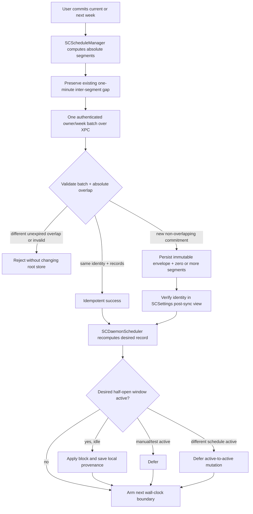
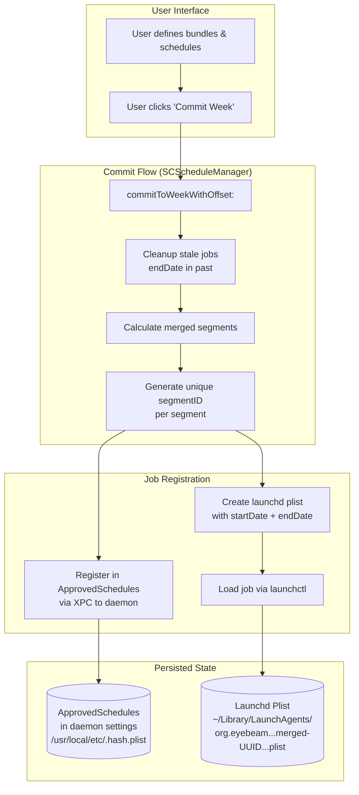
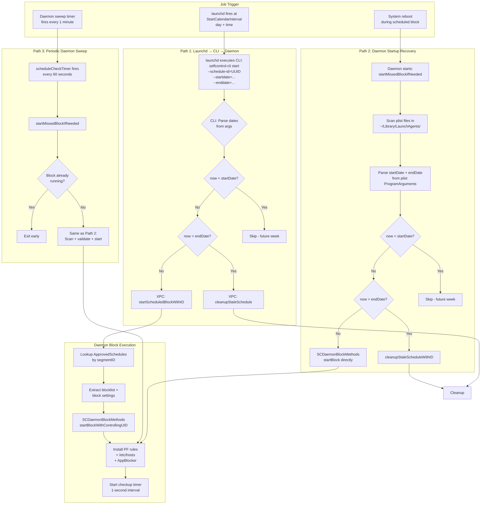
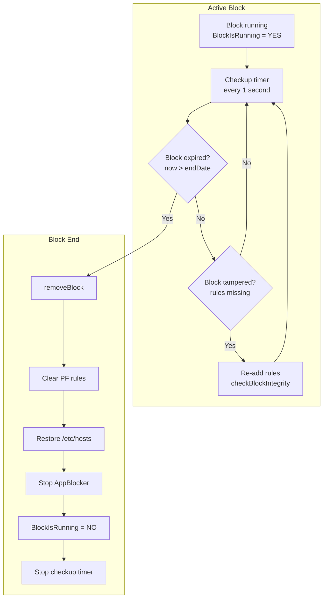
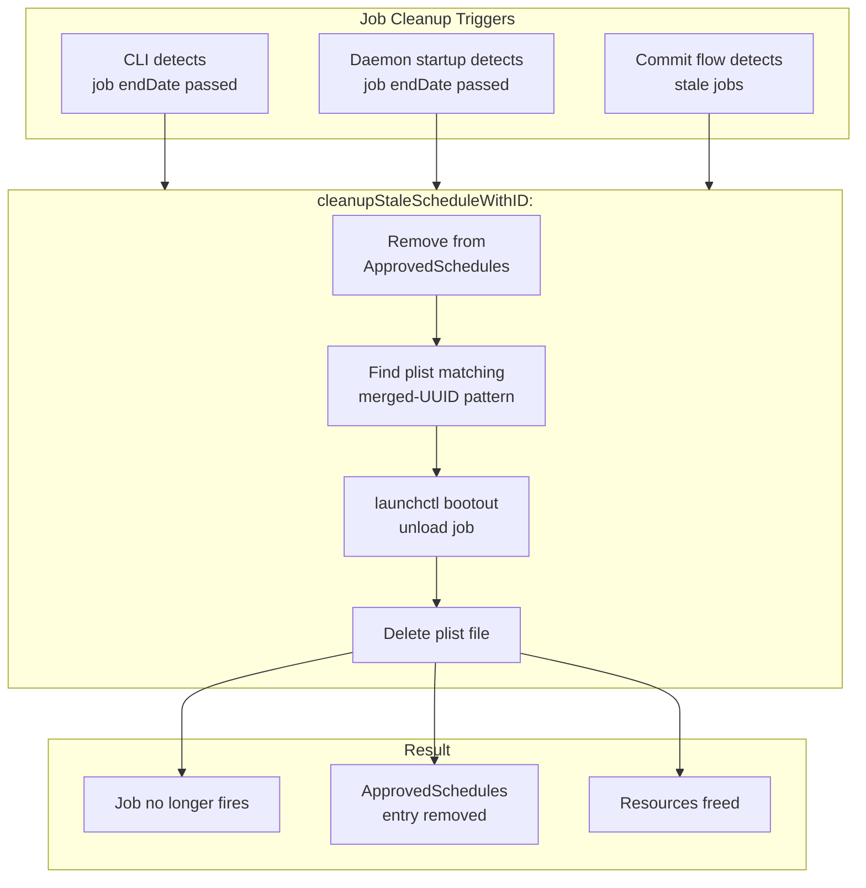
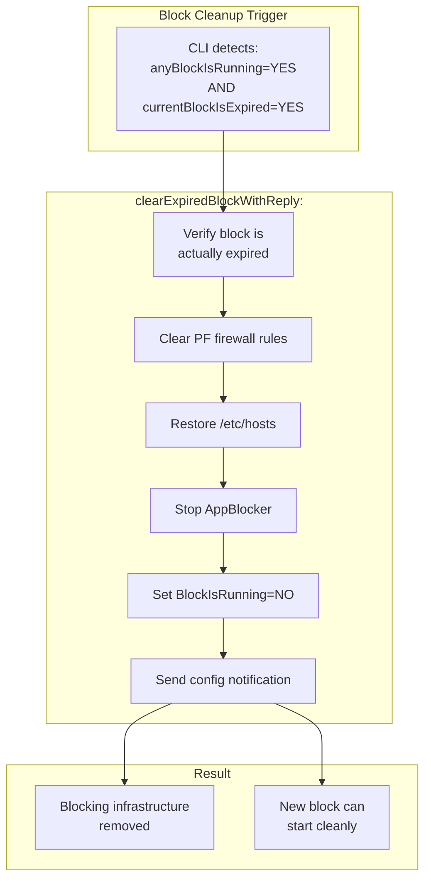
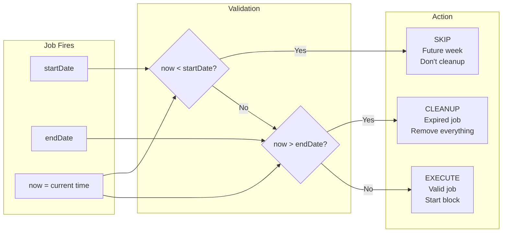
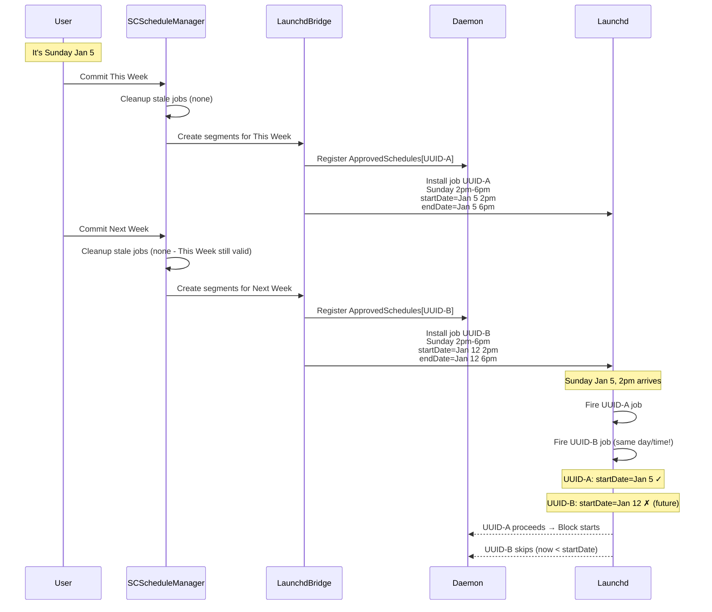

# Schedule Job Lifecycle

This document describes the complete lifecycle of committed schedule segments,
from user input to cleanup. New commitments use the V2 root scheduler. The
older per-segment LaunchAgent lifecycle is retained below as a compatibility
reference for draining V1 commitments.

> **Note:** For timezone handling and travel scenarios, see [TIMEZONE_HANDLING.md](TIMEZONE_HANDLING.md).
>
> **Note:** For daemon timers, persistence, and sleep/wake behavior, see [DAEMON_LIFECYCLE.md](DAEMON_LIFECYCLE.md).

## Current V2 Lifecycle (PER-383)



The V2 authority chain is intentionally short:

1. `SCScheduleManager` compiles the weekly UI model into zero or more
   non-overlapping absolute segments. Segment end dates retain the existing
   one-minute compatibility gap. Even a zero-segment week is a commitment.
2. `SCXPCClient` requires daemon protocol 5 and the
   `root-schedule-store-v2` / `root-schedule-timer-v1` capabilities. Helper
   repair belongs to this compatibility handshake; an ordinary commit does
   not reinstall the daemon.
3. `SCDaemonXPC` authenticates the caller and derives the owner from the audit
   token. An exact stored batch with matching commitment+generation and records
   is an idempotent retry. A
   different batch is rejected when its absolute week overlaps an unexpired
   commitment envelope or schedule record (including V1) for that owner, even
   if its local `weekKey` changed after travel. The legacy V1 registration
   selector applies the reciprocal guard: it rejects a requested segment that
   overlaps an unexpired V2 commitment envelope.
4. For a new admissible batch, the daemon persists one immutable
   `ApprovedScheduleCommitments` envelope plus zero or more
   `ApprovedSchedules` records. It verifies the envelope and every validated
   record field in SCSettings' post-sync view before reporting success; this is
   not an independent raw-disk reread.
5. `SCDaemonScheduler` serializes evaluation and applies the desired record
   through `SCDaemonBlockMethods`. The app stores a local V2 manifest only to
   map its bundle/week model to root records for strictify and diagnostics.

New V2 commits create **no** `~/Library/LaunchAgents` plist and do not invoke
`selfcontrol-cli` at a segment boundary.

The root envelope is also the commitment-lock authority when app-local state is
missing or a timezone change maps the same absolute interval to a different
week key. Loss of `SCWeekCommitment_*` / `SCScheduleManifest_*` can make the UI
need repair, but it cannot authorize a different overlapping root batch.

### Reconciliation Triggers

| Trigger | Purpose |
|---|---|
| Daemon startup | Rebuild desired state after boot, crash, or helper restart |
| Exact wall-clock boundary | Prompt start/end at the next absolute record boundary |
| Wake | Catch boundaries crossed while asleep |
| Clock or timezone change | Recompute from absolute dates after wall-time changes |
| Store mutation | Apply a newly admitted commitment immediately |
| Active-block completion | Select the next eligible record after teardown |
| 60-second backstop | Recover from a missed/coalesced notification or timer |

The timer is a promptness mechanism, not the authority. Every trigger reloads
root records and derives desired state using half-open bounds
`approvedStartDate <= now < approvedEndDate`.

### Arbitration and Transition Safety

- Manual and safety-test blocks win while active. The scheduler defers and
  retries at later triggers rather than replacing them.
- A V2 mutation that changes the desired record while another schedule-owned
  policy is active also defers. The cutover does not perform remove-then-add.
- Before treating an active schedule as already correct, the daemon compares
  owner/source and schedule identity; for V2 it also compares
  commitment/generation and policy revision, plus allowlist mode and canonical
  content. A matching denylist may be stricter than the stored policy, but it
  may not be weaker.
- The current one-minute gap between adjacent computed segments remains.
  Eliminating it requires a separate PF/hosts/AppBlocker primitive that stages
  the replacement before obsolete rules are dropped.
- Active provenance (`manual`, `test`, `legacy_schedule`, or `scheduler_v2`)
  plus schedule/revision/generation identifiers is stored only in root
  settings. It is used for idempotency and local comparison, not uploaded.

### V2 Strictify and Diagnostics

Live strictify remains monotonic. The app uses its local V2 manifest to map
bundle additions to root records, and the daemon verifies record persistence.
If one of those records is the currently active schedule, the daemon holds the
same mutation lock across active physical append/verification and the future
root-record update. It persists the stricter future record only after hosts,
PF, required app-process enforcement, and active settings verify. A retry of an
already-unioned active list still re-exercises the physical layers instead of
trusting settings alone. LaunchAgent load/probe checks are performed only for
V1 records because a V2 record deliberately has no user job.

The same backend distinction applies to startup consistency and support
snapshots:

- V2: compare app projection → root record → active provenance/physical layers.
- V1: additionally validate the plist and loaded launchd job.

Remote telemetry receives typed aggregate outcomes only. IDs, dates, UIDs,
bundle IDs, revisions, entries, and settings values remain local.

### Destructive Test Boundary

The legacy bulk-clear XPC selector is not a release recovery mechanism. Release
builds reject it even after authorization. DEBUG builds retain it for tests and
clear `ApprovedSchedules` plus `ApprovedScheduleCommitments` in the same
locked, persisted mutation. Per-record cleanup otherwise removes only expired
owner records/envelopes; a live V2 record cannot be unregistered through the
legacy selector.

## Legacy V1 Compatibility Lifecycle

> The remainder of this document describes the pre-PER-383 LaunchAgent path.
> Existing V1 approvals/jobs are supported only for bounded current/next-week
> rollback and drain. Their redundant LaunchAgent/CLI trigger still works, but
> V1 daemon recovery now comes from the same root-record scheduler described
> above; the historical plist-scanning recovery diagrams below no longer run.
> An unexpired V1 record blocks admission of an overlapping V2 commitment.

### Legacy V1 Overview Diagram



### Legacy V1 Job Firing Paths

There were **three paths** that could trigger a V1 scheduled block:

| Path | Trigger | Use Case |
|------|---------|----------|
| **Path 1** | launchd fires at scheduled time | Normal operation |
| **Path 2** | Daemon startup | Reboot during scheduled window |
| **Path 3** | Periodic daemon sweep (1 min) | Sleep/wake, launchd failures, background permission disabled |



#### Path 3: Why the Legacy Periodic Sweep Existed

The pre-PER-383 1-minute periodic sweep existed as a **backup mechanism** for cases where launchd (Path 1) failed. V2 keeps a 60-second backstop but reads the root store directly and never scans a V2 LaunchAgent:

| Scenario | launchd Behavior | Path 3 Saves the Day |
|----------|------------------|----------------------|
| **Sleep/wake** | May not fire jobs during sleep | Sweep catches it within 60s of wake |
| **Background permission disabled** | Jobs not loaded | Sweep bypasses launchd entirely |
| **launchd edge cases** | Rare timing issues | Sweep provides redundancy |

**Race condition safety:** The sweep always checks `anyBlockIsRunning` first. If launchd already started the block, the sweep exits early. Both paths can fire — only one will actually start the block.

## Block Lifecycle & Expiration



## Live Blocklist Updates (Strictify)

While a block is running, users can **add** items to bundles and have them take effect immediately. This is called "live strictify" — the block can only get **stricter**, never looser.

### Monotonic Security Constraint

| Action | Allowed? | Behavior |
|--------|----------|----------|
| **Add** item to bundle | ✅ Yes | Immediately blocked |
| **Remove** item from bundle | ❌ No | Silently ignored, logged as warning |

This prevents users from bypassing blocks by removing entries mid-session.

### Update Flow Diagram

```mermaid
sequenceDiagram
    participant UI as Frontend<br/>(SCScheduleManager)
    participant XPC as XPC Client
    participant D as Daemon mutation lock
    participant BM as BlockManager
    participant Store as Root ApprovedSchedules

    Note over UI: User edits bundle<br/>(adds twitter.com)
    UI->>UI: Preserve removals; canonicalize additions
    par Active path when expected
        UI->>XPC: appendEntriesToActiveBlocklist + exact old list
        XPC->>D: Owner/precondition-checked request
        D->>BM: Append hosts/PF/apps and verify physical result
        D->>D: Persist and verify stricter ActiveBlocklist
    and Current/future approval path
        UI->>XPC: appendEntriesToApprovedSchedules + expected lists
        XPC->>D: Match owner, schedule, mode, and exact content
        alt Candidate is the active scheduled record
            D->>BM: Physically apply and verify additions first
        end
        D->>Store: Persist and verify stricter matching records
        D->>D: Probe loaded jobs only for V1 candidates
    end
    XPC-->>UI: Typed aggregate results
    UI->>UI: Emit one block.strictify_result outcome
```

Both daemon requests use the shared mutation lock, exact preconditions, and
retry-safe union handling. In particular, the approval path cannot persist a
stricter currently-active schedule while physical enforcement remains weaker:
it applies and verifies the additions before writing that root record. A retry
that sees the exact union in settings re-applies the physical layers rather
than assuming settings are proof of enforcement.

For scheduler reconciliation, an active V2 record matches only when
schedule/owner provenance, commitment, generation, policy revision, mode, and
content agree. Denylist enforcement may contain extra entries (strictification)
but cannot omit any record entry. LaunchAgent verification applies only to V1
candidates; V2 has no user job.

### Key Source Files

| File | Method | Purpose |
|------|--------|---------|
| `Block Management/SCScheduleManager.m` | `updateBundle:` / strictify orchestration | Preserves removals, resolves active/future candidates, aggregates telemetry |
| `Common/SCXPCClient.m` | Structured append wrappers | Sends active and root-record updates |
| `Daemon/SCDaemonXPC.m` | `appendEntriesToApprovedSchedules:...` | Lock-scoped record matching, active coupling, persistence, V1-only job probes |
| `Daemon/SCDaemonBlockMethods.m` | `appendEntriesToActiveBlocklistWhileHoldingDaemonLock:...` | Canonical append, physical apply, settings persistence, postcondition verification |
| `Daemon/SCDaemonScheduler.m` | `activeState:matchesRecord:` | Full provenance/mode/content match before a verified no-op |

## Cleanup Mechanisms

There are **two types of cleanup** for different scenarios:

| Cleanup Type | Purpose | What it clears |
|--------------|---------|----------------|
| `cleanupStaleScheduleWithID:` | Remove expired **job definition** | launchd plist + ApprovedSchedules entry |
| `clearExpiredBlockWithReply:` | Remove expired **blocking rules** | PF rules + /etc/hosts + AppBlocker + BlockIsRunning flag |

### Job Cleanup (cleanupStaleScheduleWithID)

Used when a scheduled job's `endDate` has passed - removes the job definition.



### Block Cleanup (clearExpiredBlockWithReply)

Used when an active block has expired but wasn't cleared (e.g., after sleep/wake when checkup timer couldn't run).



**Sleep/Wake Scenario:**
1. Block runs from 9:00-10:00
2. User closes laptop at 9:30 (sleep)
3. At 10:00, block should expire, but checkup timer is suspended
4. At 11:00, next scheduled block tries to start
5. CLI detects: `anyBlockIsRunning=YES` but `currentBlockIsExpired=YES`
6. CLI calls `clearExpiredBlock` to clear stale blocking rules
7. New block starts successfully

## Data Structures

### Launchd Plist (Job Definition)

```
~/Library/LaunchAgents/org.eyebeam.selfcontrol.schedule.merged-{UUID}.{day}.{time}.plist
```

```xml
<dict>
    <key>Label</key>
    <string>org.eyebeam.selfcontrol.schedule.merged-550e8400-e29b-41d4.tuesday.0930</string>

    <key>ProgramArguments</key>
    <array>
        <string>/Applications/SelfControl.app/Contents/MacOS/selfcontrol-cli</string>
        <string>start</string>
        <string>--schedule-id=550e8400-e29b-41d4</string>
        <string>--startdate=2026-01-06T09:30:00Z</string>
        <string>--enddate=2026-01-06T17:00:00Z</string>
    </array>

    <key>StartCalendarInterval</key>
    <dict>
        <key>Weekday</key><integer>2</integer>
        <key>Hour</key><integer>9</integer>
        <key>Minute</key><integer>30</integer>
    </dict>

    <key>RunAtLoad</key><false/>
</dict>
```

### ApprovedSchedules Entry

```
/usr/local/etc/.{hash}.plist → ApprovedSchedules dictionary
```

```objc
ApprovedSchedules[@"550e8400-e29b-41d4"] = @{
    @"blocklist": @[@"facebook.com", @"app:com.apple.Terminal"],
    @"isAllowlist": @NO,
    @"blockSettings": @{
        @"ClearCaches": @YES,
        @"AllowLocalNetworks": @NO
    },
    @"controllingUID": @501,
    @"registeredAt": <NSDate>
};
```

## Validation Logic



## Multi-Week Commit Scenario (Sunday)



## Key Files

| File | Purpose |
|------|---------|
| `Block Management/SCScheduleManager.m` | Commit flow, segment calculation, cleanup orchestration, **live strictify trigger** |
| `Common/SCXPCClient.m` | V2 compatibility gate and authenticated owner/week batch |
| `Daemon/SCDaemonScheduler.m` | V2 desired-state selection, boundary timer, backstop, and serialized reconciliation |
| `Block Management/SCScheduleLaunchdBridge.m` | V1 plist creation/cleanup compatibility only |
| `Block Management/BlockManager.m` | Block installation, **append mode for live updates** |
| `Block Management/PacketFilter.m` | PF rule management, **append mode for live updates** |
| `cli-main.m` | V1 compatibility arg parsing, validation, and XPC calls |
| `Daemon/SCDaemon.m` | Scheduler construction and startup/wake/clock/timezone triggers |
| `Daemon/SCDaemonXPC.m` | Atomic V2 store, V1 bridge, strictify, diagnostics, and cleanup |
| `Daemon/SCDaemonBlockMethods.m` | Actual block execution, checkup timer, **monotonic update enforcement** |
| `Common/SCSentry.m` | Typed schedule/strictify telemetry schemas and privacy tripwire |

---

*Last updated: July 2026 (PER-383)*
