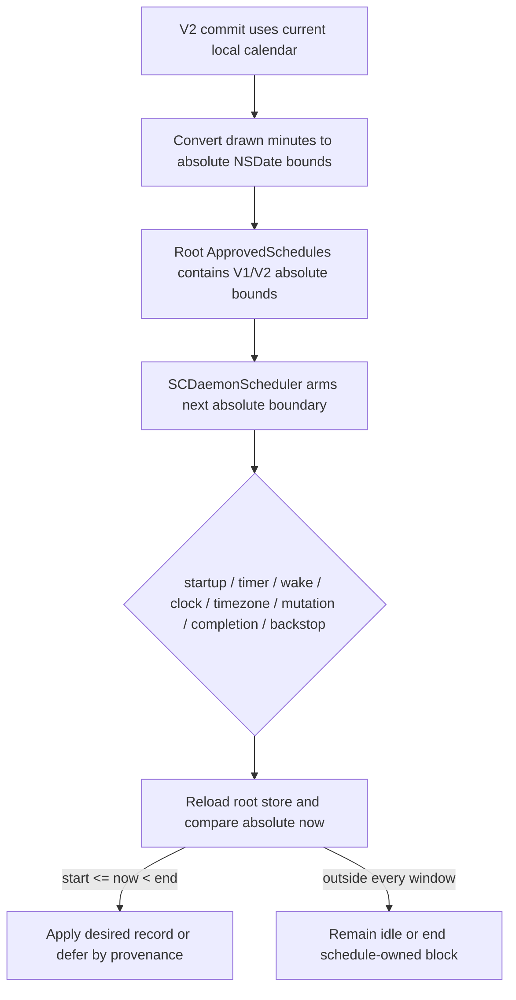
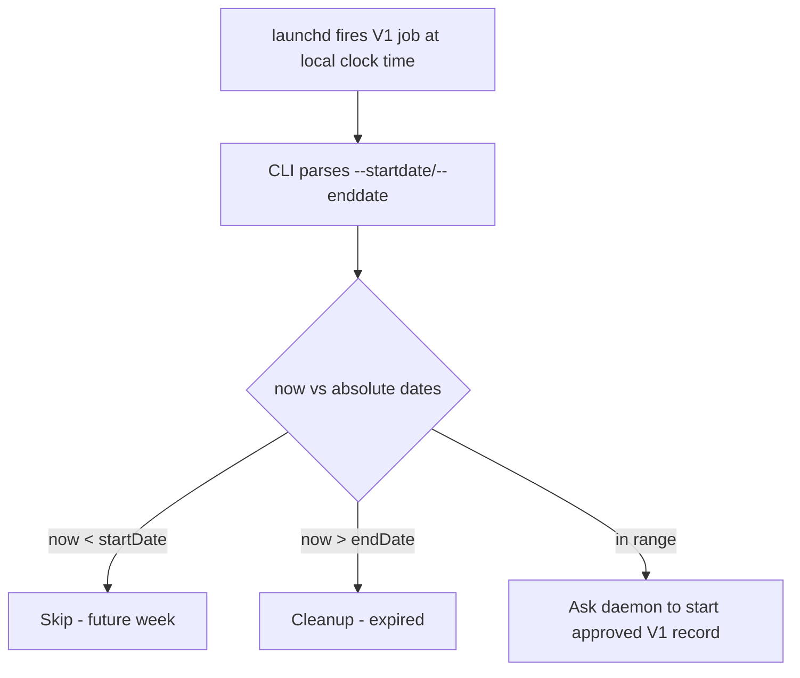
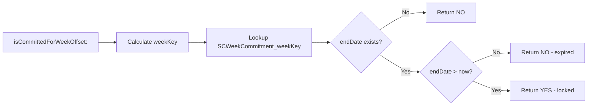
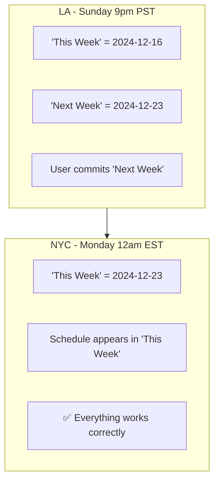
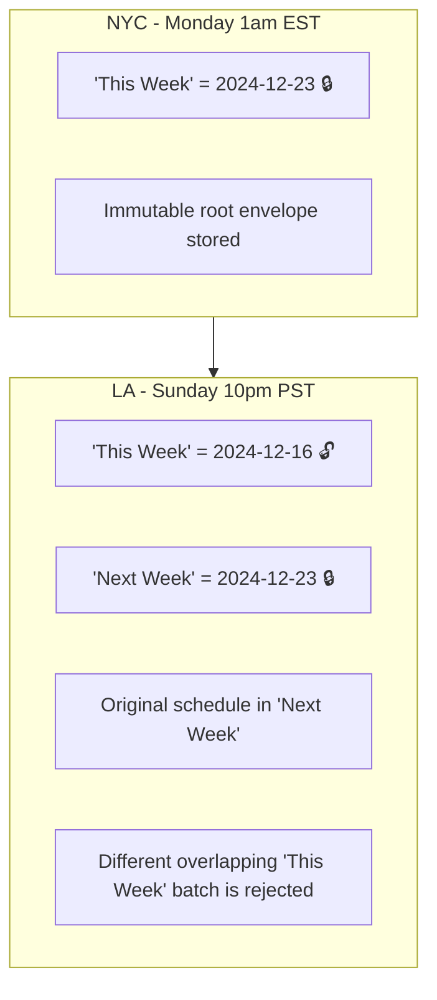
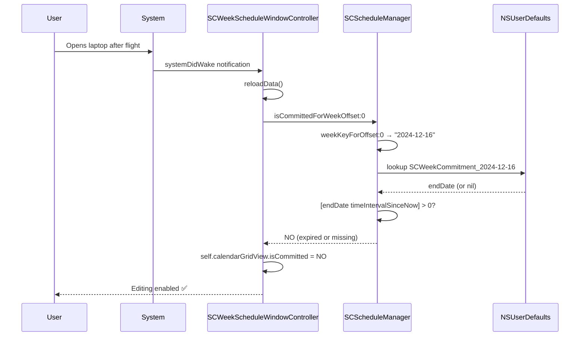
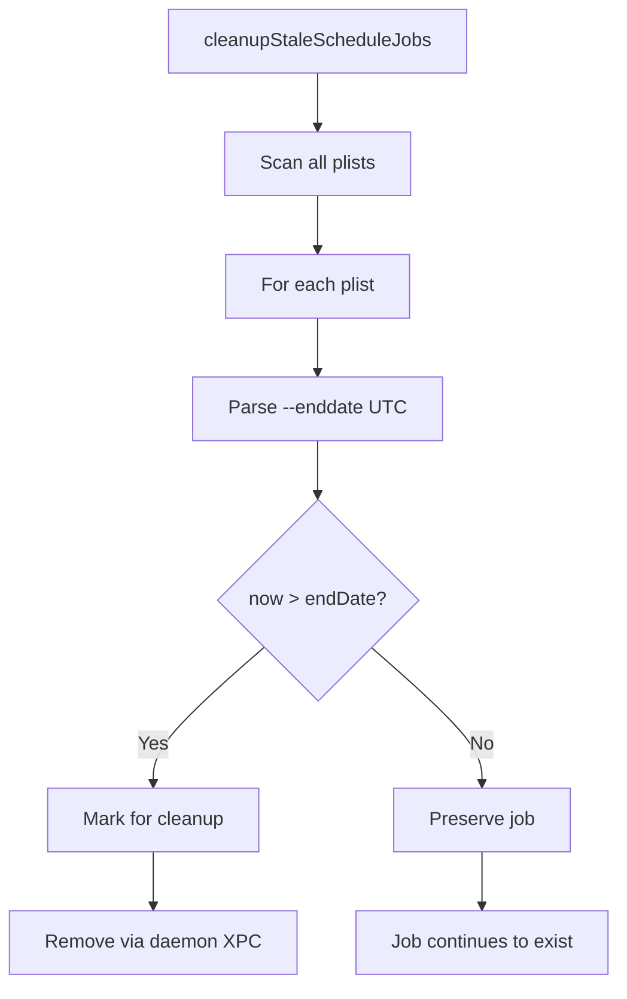

# Timezone Handling in Fence

This document explains how Fence handles timezone changes, including travel scenarios and the design decisions behind the implementation.

## Overview

Fence uses a **timezone-rigid** design for anti-circumvention:
- Block times are stored as **absolute UTC timestamps**
- Users cannot escape blocks by changing their system timezone
- For travel, users should set their timezone to the destination **before** committing

Under PER-383, `selfcontrold` is the timing authority for new V2 commitments.
It compares `NSDate` values directly and re-evaluates when macOS reports a
timezone or wall-clock change. A timezone change does not rewrite committed
absolute boundaries.

---

## Core Concepts

### How Dates Are Stored

| Data | Storage Location | Format |
|------|------------------|--------|
| V2 block start/end times | Root `ApprovedSchedules` record | `NSDate` absolute timestamps |
| V2 commitment lock | Root `ApprovedScheduleCommitments` envelope | Owner + absolute week bounds + commitment/generation; present even with zero segments |
| V2 next firing | `SCDaemonScheduler` wall-clock timer | Next absolute record boundary |
| V1 block start/end times (drain only) | launchd plist `ProgramArguments` | ISO8601 UTC (`2026-01-06T09:30:00Z`) |
| V1 launchd trigger (drain only) | launchd plist `StartCalendarInterval` | Local time (weekday, hour, minute) |
| Commitment end date | NSUserDefaults (`SCWeekCommitment_{weekKey}`) | NSDate (absolute timestamp) |
| V2 local manifest | NSUserDefaults (`SCScheduleManifest_{weekKey}`) | IDs and absolute dates for local mapping only |
| Week key | Derived from local time | String (`"2024-12-23"`) |

### Drawn Allow Windows (Before Commit)

Allow windows drawn in the UI are stored as **timezone-agnostic minute offsets**:

```objc
// SCTimeRange stores just minutes from midnight
@property NSInteger startMinutes;  // e.g., 960 = 4pm (16 * 60)
@property NSInteger endMinutes;    // e.g., 1080 = 6pm (18 * 60)
```

**Key point:** 4pm is always 4pm in the UI - drawn blocks don't shift when you change timezone.

The timezone conversion only happens **at commit time**:
1. User draws 4pm-6pm allow window → stored as minutes (960-1080)
2. User changes Mac timezone to destination
3. User clicks "Commit"
4. App uses `[NSCalendar currentCalendar]` (now destination timezone) to calculate absolute dates
5. "4pm local" becomes the correct UTC time for the destination

This is why changing timezone before committing works - the drawn blocks stay visually the same, but the UTC conversion uses the new timezone.

### Current V2 Time Semantics

V2 has no local-calendar launch trigger after commit. The app uses the current
calendar/timezone once to compile drawn minute offsets into absolute dates.
Thereafter the daemon selects a record with the half-open predicate
`start <= now < end`, arms its next absolute boundary, and re-runs selection on
timezone or system-clock notifications. The 60-second backstop catches a
coalesced/missed notification.

### Legacy V1 Timezone Mismatch

V1 rollback/drain jobs retain an intentional mismatch between job firing and
job validation:

```
launchd fires based on:     LOCAL clock time (StartCalendarInterval)
Validation uses:            UTC timestamps (--startdate, --enddate)
```

This prevents circumvention - changing timezone doesn't change when blocks end in absolute terms.

---

## Schedule Launch Paths

### Current Root Scheduler Path (V1 and V2)



A timezone change can change which week key the UI displays, but it cannot
move the already-stored start/end instants. The scheduler reads both V1 and V2
dates from root `ApprovedSchedules`; it does not recover timing by parsing a
LaunchAgent. Separately, the root commitment envelope compares absolute week
bounds, so a shifted `weekKey` cannot make an overlapping week recommittable.

### Legacy V1 Redundant LaunchAgent Trigger

Draining V1 records may also be triggered by their historical user
LaunchAgent/CLI path. It is redundant with root-scheduler reconciliation and
exists only for rollback/drain. New V2 commitments do not create this path.



#### launchd → CLI validation

**File:** `cli-main.m` (lines 146-190)

```objc
// Parse UTC dates from command line args
NSISO8601DateFormatter* isoFormatter = [NSISO8601DateFormatter new];
NSDate* blockStartDateArg = [isoFormatter dateFromString: startDateString];
NSDate* blockEndDateArg = [isoFormatter dateFromString: endDateString];
NSDate* now = [NSDate date];

// Validate against absolute time
if (blockStartDateArg != nil && [now compare:blockStartDateArg] == NSOrderedAscending) {
    // Job is for future week - skip
    exit(EXIT_SUCCESS);
}

if (blockEndDateArg == nil || [now compare:blockEndDateArg] == NSOrderedDescending) {
    // Job has expired - cleanup
    // ...
}
```

---

## Week Key Calculation

Week keys are calculated using **local time**, which means they shift with timezone changes.

**File:** `Block Management/SCWeeklySchedule.m` (lines 402-422)

```objc
+ (NSDate *)startOfWeekContaining:(NSDate *)date {
    NSCalendar *calendar = [NSCalendar currentCalendar];  // Uses LOCAL timezone
    NSDateComponents *components = [calendar components:NSCalendarUnitWeekday fromDate:date];
    NSInteger weekday = components.weekday;

    // Calculate days to subtract to get to Monday
    NSInteger daysToMonday = (weekday == 1) ? -6 : -(weekday - 2);
    NSDate *monday = [calendar dateByAddingUnit:NSCalendarUnitDay value:daysToMonday toDate:date options:0];

    return [calendar startOfDayForDate:monday];
}

+ (NSString *)weekKeyForDate:(NSDate *)date {
    NSDate *weekStart = [self startOfWeekContaining:date];
    NSDateFormatter *formatter = [[NSDateFormatter alloc] init];
    formatter.dateFormat = @"yyyy-MM-dd";
    return [formatter stringFromDate:weekStart];  // e.g., "2024-12-23"
}
```

### Week Key Shift Example

```
NYC (Monday 1am EST):  weekKey = "2024-12-23"  (This Monday)
LA  (Sunday 10pm PST): weekKey = "2024-12-16"  (Previous Monday!)
```

---

## Commitment Status

### How `isCommitted` is Computed

There is **no stored `isCommitted` variable**. It's computed on-the-fly:

**File:** `Block Management/SCScheduleManager.m` (lines 413-423)

```objc
- (BOOL)isCommittedForWeekOffset:(NSInteger)weekOffset {
    NSDate *endDate = [self commitmentEndDateForWeekOffset:weekOffset];
    if (!endDate) return NO;                      // No commitment stored
    return [endDate timeIntervalSinceNow] > 0;    // Is endDate still in future?
}

- (nullable NSDate *)commitmentEndDateForWeekOffset:(NSInteger)weekOffset {
    NSString *weekKey = [self weekKeyForOffset:weekOffset];
    NSString *storageKey = [kWeekCommitmentPrefix stringByAppendingString:weekKey];
    return [[NSUserDefaults standardUserDefaults] objectForKey:storageKey];
}
```



### Why This Design Works for Travel

When you travel, absolute time keeps moving forward even as local time shifts:

```
Old commitment endDate:  Dec 23, 5am UTC (Sunday midnight EST)
Current time in LA:      Dec 23, 6am UTC (Sunday 10pm PST)

[endDate timeIntervalSinceNow] = 5am - 6am = -1 hour (NEGATIVE)
Result: NO (unlocked)
```

The old commitment is **expired in absolute terms**, so it doesn't lock the week.

---

## Travel Scenarios

### Scenario 1: Eastward Travel (Forward in Time)

**Example:** LA (Sunday) → NYC (Monday)



**Result:** Safe. "Next Week" naturally becomes "This Week" as time progresses.

### Scenario 2: Westward Travel (Back in Time)

**Example:** NYC (Monday 1am EST) → LA (Sunday 10pm PST)



**What happens:**

| Aspect | Before (NYC) | After (LA) |
|--------|--------------|------------|
| Week key for offset 0 | "2024-12-23" | "2024-12-16" |
| "This Week" committed? | YES (locked) | NO (unlocked) |
| "Next Week" committed? | N/A | YES (locked) |
| Original schedule visible? | In "This Week" | In "Next Week" |
| Can commit a different overlapping "This Week" batch? | No | **No — root absolute-week overlap rejects it** |

The local UI may initially derive an unlocked state for the shifted
`SCWeekCommitment_<weekKey>` key, but root admission is fail-closed. An exact
commitment+generation retry is idempotent; a different overlapping batch is
rejected independently of the local week key.

---

## UI Update Mechanism

The UI `isCommitted` properties are refreshed from the manager on various triggers:

**File:** `SCWeekScheduleWindowController.m`

```objc
- (void)reloadData {
    SCScheduleManager *manager = [SCScheduleManager sharedManager];
    BOOL isCommitted = [manager isCommittedForWeekOffset:self.currentWeekOffset];

    // Update all UI views
    self.bundleSidebar.isCommitted = isCommitted;
    self.calendarGridView.isCommitted = isCommitted;
    self.weekGridView.isCommitted = isCommitted;
}
```

### When UI Refreshes

| Trigger | Code Location | Relevant for Travel? |
|---------|---------------|---------------------|
| System wake | `systemDidWake:` (line 315) | ✅ After flight |
| Refresh timer | `refreshTimerFired:` every 5 min (line 324) | ✅ Background |
| Window init | `initWithWindow:` (line 90) | If app reopened |
| Window resize | `windowDidResize:` (line 310) | Minor |



This UI projection is not the admission authority. If local marker lookup says
unlocked while an unexpired root envelope overlaps the selected absolute week,
a different commit is still rejected.

---

## Cleanup Safety

Unexpired commitment envelopes are immutable, and admission cannot replace
their segment records with a different batch. The only in-place record change
is monotonic strictify, which can add enforcement but not loosen identity,
bounds, mode, or content. Admission compares authenticated owner plus absolute
week bounds, not only the local week key. An exact same-batch identity/content
retry is idempotent; a different overlapping batch is rejected.
Expired/out-of-window records can drain through normal cleanup, and an envelope
with zero segments remains a real commitment until its absolute end.

Unexpired V1 records are never removed to make room for V2. They continue to
drain and reject an overlapping V2 envelope. The compatibility guard also runs
in the other direction: a legacy V1 registration is rejected if its absolute
window overlaps an unexpired V2 envelope, including after a timezone-derived
week-key shift. Release builds reject bulk clearing; DEBUG tests clear both
root maps together.

### Legacy V1 Cleanup

**File:** `Block Management/SCScheduleManager.m` (lines 851-925)

```objc
- (void)cleanupStaleScheduleJobs {
    NSDate *now = [NSDate date];

    for (NSString *file in files) {
        // Parse endDate from plist
        NSDate *endDate = [isoFormatter dateFromString:endDateStr];

        // Only cleanup if EXPIRED (endDate in past)
        if (endDate && [now compare:endDate] == NSOrderedDescending) {
            [staleSegmentIDs addObject:segmentID];
        }
    }
}
```

**Key:** Cleanup uses **UTC endDate comparison**, not week keys. Future jobs are always preserved.



### Recommit After Travel

When a user commits for "This Week" after traveling:

1. **New endDate calculated** in current timezone
2. **One V2 owner/absolute-week batch** is checked against root envelopes and
   schedule records, including V1
3. **Exact same identity and record content** returns idempotently
4. **Different unexpired overlap** is rejected even if `weekKey` shifted
5. **New non-overlapping commitment** stores an immutable envelope plus zero or
   more records; the local manifest remains a mapping aid
6. **No new LaunchAgents** are created, and live V1 jobs are not replaced

```objc
NSString *weekKey = [self weekKeyForOffset:weekOffset];
// weekStart/weekEnd are resolved with the current local calendar.
[xpc replaceScheduledCommitmentForWeekKey:weekKey
                             weekStartDate:weekStart
                               weekEndDate:weekEnd
                              commitmentID:commitmentID
                                generation:generation
                                  segments:absoluteSegments
                                     reply:...];
```

---

## User Guidance

### For Traveling Users

> **Before traveling:** Change your Mac's timezone to your destination in System Preferences, **then** commit your schedule. Your blocks will operate correctly in the destination timezone.

If the week is already committed, changing timezone does not move it and does
not permit an overlapping replacement. The original absolute schedule remains
authoritative until its envelope expires.

### Why This Matters

| If you... | Then... |
|-----------|---------|
| Commit a V2 week in origin timezone, then travel | Every stored start/end remains the same absolute instant and therefore appears shifted in destination local time |
| Change to destination timezone first, then commit | Everything aligned - blocks work correctly at destination |

Draining V1 jobs retain their local `StartCalendarInterval`, but the CLI still
validates the original absolute start/end dates. That compatibility behavior
must not be used to infer V2 timing.

### Premature Unlock / Zombie Lock

These are **expected behaviors**, not bugs:

| Scenario | What Happens | Why |
|----------|--------------|-----|
| **Premature Unlock** (westward) | Commitment ends earlier in local time | UTC endpoint reached earlier locally |
| **Zombie Lock** (eastward) | Commitment persists past local midnight | UTC endpoint not yet reached |

This is intentional - it prevents timezone circumvention while providing predictable behavior.

---

## Summary

| Component | Timezone Behavior |
|-----------|-------------------|
| V2 root start/end dates | Absolute `NSDate` values selected by `selfcontrold` |
| V2 exact timer | Absolute wall-clock boundary; recomputed after clock/timezone changes |
| V1 `StartCalendarInterval` | Local time (rollback/drain only) |
| V1 `--startdate` / `--enddate` | UTC validation (rollback/drain only) |
| Week key calculation | Local time (can shift) |
| Commitment endDate | Absolute NSDate (doesn't shift) |
| `isCommitted` check | Compares absolute times |
| V2 admission | Authenticated owner + absolute-week overlap; immutable envelope survives local marker/week-key drift |
| V1 cleanup | Uses absolute endDate comparison |

**Design principle:** Blocks are anchored to **absolute time** for security. Users control their experience by setting timezone **before** committing.

---

*Last updated: July 2026 (PER-383)*
