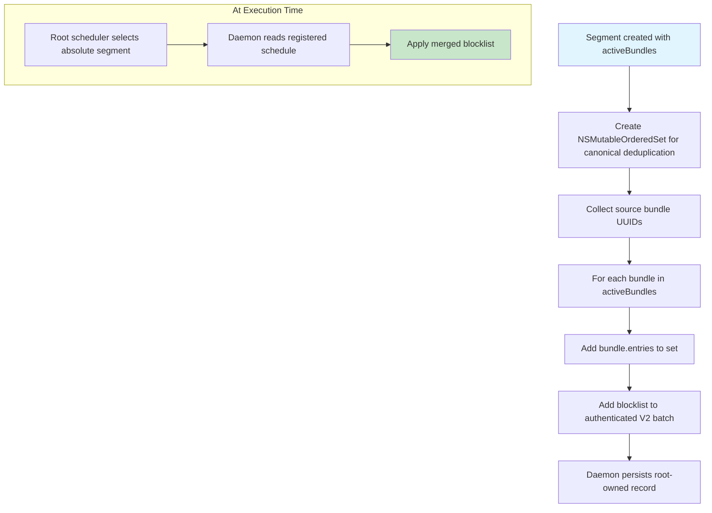

# Merged Blocklist

<!-- KEYWORDS: merged, blocklist, combine, entries, deduplicate, segment, union -->

**Also known as:** Combined Blocklist, Unified Blocklist

---

## Brief Definition

The combined, deduplicated list of entries from all active bundles in a segment.

---

## Detailed Definition

When multiple bundles are active in a [Segment](segment.md), their entries (websites and apps) are merged into a single blocklist. This merged blocklist is what actually gets blocked during that time period.

**Example:**
```
Segment 10:00-12:00, Active Bundles: [A, B]

Bundle A entries: facebook.com, twitter.com
Bundle B entries: twitter.com, reddit.com, app:com.apple.Terminal

Merged Blocklist: facebook.com, twitter.com, reddit.com, app:com.apple.Terminal
                  (twitter.com deduplicated)
```

---

## Context/Trigger

- Created at commit time for each Segment
- Stored inside the V2 root-owned schedule batch
- Selected by segment ID when `selfcontrold` reconciles an absolute boundary
- Draining V1 jobs may still use a `.selfcontrol` file/LaunchAgent bridge

---

## Code Locations

| File | Purpose |
|------|---------|
| `Block Management/SCScheduleManager.m` | Current V2 canonical merge during commitment |
| `Daemon/SCDaemonXPC.m` | Batch validation and root-store persistence |
| `Block Management/SCScheduleLaunchdBridge.m` | V1 file/job compatibility path |

---

## Current V2 Storage

The canonical merged entries are the `blocklist` field of the corresponding
[Root-Owned Schedule](root-owned-schedule.md). They are sent only across the
authenticated local XPC boundary and persisted in root settings.

## Legacy V1 Storage Format

```
~/Library/Application Support/SelfControl/Schedules/{segmentID}.selfcontrol

Contents (plist):
{
    "Blocklist": ["facebook.com", "twitter.com", "app:com.bundle.id"],
    "BlockAsWhitelist": false
}
```

---

## Call Stack



---

## Related Terms

- [Segment](segment.md) - Each segment has one merged blocklist
- [Entry](entry.md) - Individual items in the blocklist
- [Bundle](bundle.md) - Source of entries to merge
- [Pre-Authorized Schedule](pre-authorized-schedule.md) - Contains the merged blocklist
- [Root-Owned Schedule](root-owned-schedule.md) - Current V2 storage/execution form

---

## Anti-definitions (What this is NOT)

- **NOT** a single bundle's entries - combines multiple bundles
- **NOT** created by the user - computed from segment's active bundles
- **NOT** stored in user preferences - stored in Schedules directory as separate file

---

## Code Example

```objc
- (NSURL *)writeMergedBlocklistForBundles:(NSArray<SCBlockBundle *> *)bundles
                                segmentID:(NSString *)segmentID
                                    error:(NSError **)error {
    // Merge all entries from all bundles, deduplicating
    NSMutableOrderedSet *mergedEntries = [NSMutableOrderedSet orderedSet];
    for (SCBlockBundle *bundle in bundles) {
        [mergedEntries addObjectsFromArray:bundle.entries];
    }

    // Write to file
    NSURL *fileURL = [[SCScheduleLaunchdBridge schedulesDirectory]
                      URLByAppendingPathComponent:
                          [NSString stringWithFormat:@"%@.selfcontrol", segmentID]];

    NSDictionary *blockInfo = @{
        @"Blocklist": mergedEntries.array,
        @"BlockAsWhitelist": @NO
    };

    // ... write to disk
}
```
