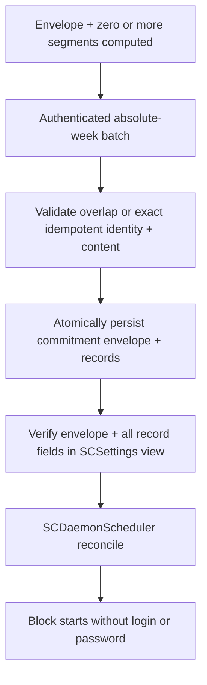

# Pre-Authorized Schedule

<!-- KEYWORDS: pre-authorized, preauthorized, registered, daemon, password-free, schedule-id, launchd, root scheduler -->

**Also known as:** Registered Schedule, Daemon-Authorized Schedule

---

## Brief Definition

A segment registered with the daemon at commit time, allowing execution without
password prompts at runtime. New V2 commitments use a
[Root-Owned Schedule](root-owned-schedule.md); the per-segment LaunchAgent form
described below is retained only for V1 rollback/drain compatibility.

---

## Detailed Definition

Pre-Authorized Schedules solve the UX problem of requiring password prompts
every time a scheduled block starts. For current V2 commitments, an immutable
absolute-week envelope and all of its segments are authorized in one atomic
root-store batch and
`selfcontrold` starts them directly. Existing V1 commitments used the older
per-segment flow:

1. **Merged blocklist** stored in root-owned settings (`/usr/local/etc/`)
2. **Segment ID (UUID)** used as reference
3. **V2:** the daemon's wall-clock scheduler selects the active record
4. **V1 compatibility:** a launchd job triggers the CLI with `--schedule-id UUID`
5. **At runtime:** the daemon looks up the pre-registered schedule, no new auth
   prompt is needed

This is the same data as a Segment, but the term emphasizes it's been **authorized for future execution**.

---

## Context/Trigger

- Created during `commitToWeekWithOffset:completion:`
- V2 calls `replaceScheduledCommitmentForWeekKey:...` once for the
  owner/absolute week
- Daemon rejects a different unexpired overlap, treats an exact
  same-batch identity/content retry as idempotent, and persists the envelope even
  when there are zero segments
- Legacy V1 registration is also rejected when it overlaps an unexpired V2
  envelope; compatibility cannot overwrite the new authority
- V2 is reconciled by `SCDaemonScheduler`; only draining V1 jobs reference
  `--schedule-id`

---

## Code Locations

| File | Purpose |
|------|---------|
| `Block Management/SCScheduleManager.m` | Compiles and submits the V2 owner/absolute-week batch |
| `Common/SCXPCClient.m` | `replaceScheduledCommitmentForWeekKey:...` |
| `Daemon/SCDaemonXPC.m` | Enforces overlap immutability/idempotency and persists the envelope + records |
| `Daemon/SCDaemonScheduler.m` | Reconciles V2 records from wall time |
| `Block Management/SCScheduleLaunchdBridge.m` | V1 compatibility job handling only |

---

## Storage

```
/usr/local/etc/.{hash}.plist  (root-owned)

ApprovedScheduleCommitments: {
    "{commitment-UUID}": {
        "schemaVersion": 1,
        "weekKey": "YYYY-MM-DD",
        "weekStartDate": <absolute date>,
        "weekEndDate": <absolute date>,
        "commitmentID": "{UUID}",
        "generation": "{UUID}",
        "controllingUID": <authenticated owner>,
        "scheduleIDs": ["{segment-UUID}", ...],
        "registeredAt": <absolute date>
    }
}

ApprovedSchedules: {
    "{segment-UUID}": {
        "schemaVersion": 2,
        "weekKey": "YYYY-MM-DD",
        "commitmentID": "{UUID}",
        "generation": "{UUID}",
        "policyRevision": "{UUID}",
        "approvedStartDate": <absolute date>,
        "approvedEndDate": <absolute date>,
        "sourceBundleIDs": ["{UUID}", ...],
        "blocklist": [...],
        "isAllowlist": false,
        "blockSettings": {...},
        "controllingUID": <authenticated owner>
    }
}
```

V1 records omit the V2 identity/week fields and may still have a corresponding
user LaunchAgent during the drain window. An unexpired V1 record is not
replaced; it rejects admission of an overlapping V2 envelope until it drains.
Conversely, a new V1 registration cannot overlap an unexpired V2 envelope.
Release builds reject bulk clearing; DEBUG tests clear both root maps together.

---

## Current V2 Call Stack



## Legacy V1 Call Stack

```mermaid
graph TD
    subgraph "Legacy V1 Commit Time"
        A[Segment created] --> B[registerScheduleWithID:blocklist:...]
        B --> C[XPC call to daemon]
        C --> D[Daemon stores in ApprovedSchedules]
        D --> E[Create launchd job with --schedule-id]
    end

    subgraph "Legacy V1 Scheduled Time"
        F[launchd triggers at start time] --> G[selfcontrol-cli start --schedule-id UUID]
        G --> H[CLI calls startScheduledBlockWithID:endDate:]
        H --> I[Daemon looks up UUID in ApprovedSchedules]
        I --> J[Block starts - no auth prompt]
    end

    style A fill:#e1f5fe
    style J fill:#c8e6c9
```



---

## Related Terms

- [Segment](segment.md) - Pre-Authorized Schedule IS a registered segment
- [Root-Owned Schedule](root-owned-schedule.md) - current V2 representation
- [Committed State](committed-state.md) - Pre-authorization happens at commit
- [Merged Blocklist](merged-blocklist.md) - Stored with the pre-authorized schedule

---

## Anti-definitions (What this is NOT)

- **NOT** a different data structure than Segment - same data, different lifecycle stage
- **NOT** stored in user preferences - stored in root-owned daemon settings
- **NOT** triggered by password at runtime - that's the whole point

---

## Lifecycle

```
Segment (computed)
    ↓ authenticated immutable absolute-week admission
Root-Owned Schedule (stored in daemon)
    ↓ selfcontrold reconciles at an absolute boundary
Active Block (blocking in effect)
    ↓ endDate reached
Expired (cleaned up)
```

---

## Legacy V1 launchd Job Format

This format is documented for rollback/drain support. New V2 commitments do
not create it.

```xml
<plist>
    <dict>
        <key>Label</key>
        <string>org.eyebeam.selfcontrol.schedule.merged-{UUID}.monday.0900</string>
        <key>ProgramArguments</key>
        <array>
            <string>/path/to/selfcontrol-cli</string>
            <string>start</string>
            <string>--schedule-id={UUID}</string>
            <string>--enddate=2024-12-23T17:00:00Z</string>
        </array>
        <key>StartCalendarInterval</key>
        <dict>
            <key>Weekday</key><integer>1</integer>
            <key>Hour</key><integer>9</integer>
            <key>Minute</key><integer>0</integer>
        </dict>
    </dict>
</plist>
```
